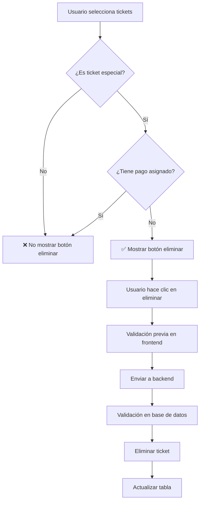

# 🎫 Implementación de Eliminación de Tickets Especiales

## 📋 Resumen
Se implementó la funcionalidad de eliminación restringida para tickets especiales sin pago asignado, siguiendo las mejores prácticas de seguridad y validación.

## ✅ Condiciones de Eliminación
- **Solo tickets especiales**: `es_ticket_especial = true`
- **Sin pago asignado**: `pago_id IS NULL`
- **No eliminar tickets normales**
- **No eliminar tickets con pago asignado**

## 🔧 Archivos Modificados

### 1. `lib/database/admin_database/tickets.ts`
- **Función `adminDeleteTicket`**: Agregadas validaciones estrictas
- **Nueva función `adminDeleteMultipleTickets`**: Eliminación múltiple con validaciones
- **Logging detallado**: Para debugging y auditoría

```typescript
// Validaciones implementadas:
1. Verificar que el ticket existe
2. Validar que es especial (es_ticket_especial = true)
3. Validar que no tiene pago asignado (pago_id IS NULL)
4. Proceder con eliminación solo si pasa todas las validaciones
```

### 2. `hooks/use-crud-tickets.ts`
- **Función `deleteMultipleTickets`**: Actualizada para usar la nueva función optimizada
- **Manejo de detalles**: Retorna información sobre tickets eliminados vs rechazados
- **Importación dinámica**: Para mejor rendimiento

### 3. `app/admin/components/tables/TicketsTable.tsx`
- **Botón de eliminación condicional**: Solo visible para tickets especiales sin pago
- **Icono distintivo**: Usa icono `Gift` para tickets especiales
- **Tooltip informativo**: Explica por qué se puede eliminar

```tsx
// Lógica de visibilidad del botón:
const esEspecialSinPago = ticket.es_ticket_especial && !ticket.pago_id
{esEspecialSinPago && (
  <Button variant="destructive" size="sm">
    <Gift className="mr-2 h-4 w-4" />
    Eliminar
  </Button>
)}
```

### 4. `app/admin/(panel)/tickets/page.tsx`
- **Validación previa**: Verifica condiciones antes de eliminar
- **Mensajes de error detallados**: Explica por qué no se puede eliminar
- **Modal actualizado**: Título y descripción específicos para tickets especiales

## 🛡️ Seguridad Implementada

### Validaciones en Base de Datos
1. **Verificación de existencia**: El ticket debe existir
2. **Verificación de tipo**: Solo tickets especiales
3. **Verificación de estado**: Sin pago asignado
4. **Logging completo**: Para auditoría y debugging

### Validaciones en Frontend
1. **Filtrado visual**: Solo mostrar botones para tickets eliminables
2. **Validación previa**: Verificar condiciones antes de enviar
3. **Mensajes claros**: Explicar restricciones al usuario

## 🧪 Testing

### Script de Prueba
- **Archivo**: `toolbox/test-special-tickets-deletion.js`
- **Funcionalidades**:
  - Categorizar tickets por tipo y estado
  - Identificar tickets eliminables vs no eliminables
  - Probar eliminación de tickets válidos
  - Verificar que tickets inválidos no se pueden eliminar

### Casos de Prueba
1. ✅ **Ticket especial sin pago**: Se puede eliminar
2. ❌ **Ticket especial con pago**: No se puede eliminar
3. ❌ **Ticket normal sin pago**: No se puede eliminar
4. ❌ **Ticket normal con pago**: No se puede eliminar

## 📊 Flujo de Eliminación



## 🎯 Beneficios

1. **Seguridad**: Solo se pueden eliminar tickets que cumplen condiciones específicas
2. **Claridad**: El usuario sabe exactamente qué tickets se pueden eliminar
3. **Auditoría**: Logging completo de todas las operaciones
4. **Mantenibilidad**: Código bien documentado y modular
5. **Rendimiento**: Validaciones optimizadas en base de datos

## 🚀 Uso

### Para Administradores
1. Ir a la página de tickets (`/admin/tickets`)
2. Los tickets especiales sin pago mostrarán un botón rojo "Eliminar"
3. Hacer clic en eliminar y confirmar
4. El sistema validará automáticamente las condiciones

### Para Desarrolladores
1. Usar `adminDeleteTicket(id)` para eliminación individual
2. Usar `adminDeleteMultipleTickets(ids)` para eliminación múltiple
3. Ambas funciones incluyen validaciones automáticas
4. Revisar logs para debugging

## 📝 Notas Importantes

- **No se pueden eliminar tickets con pago asignado**: Esto protege la integridad de los datos de pago
- **Solo tickets especiales**: Los tickets normales no se pueden eliminar por seguridad
- **Logging completo**: Todas las operaciones se registran para auditoría
- **Validaciones dobles**: Tanto en frontend como en backend para máxima seguridad

## 🔄 Próximos Pasos

1. **Monitoreo**: Revisar logs de eliminación regularmente
2. **Feedback**: Recopilar feedback de usuarios sobre la funcionalidad
3. **Optimización**: Mejorar rendimiento si es necesario
4. **Documentación**: Mantener documentación actualizada


